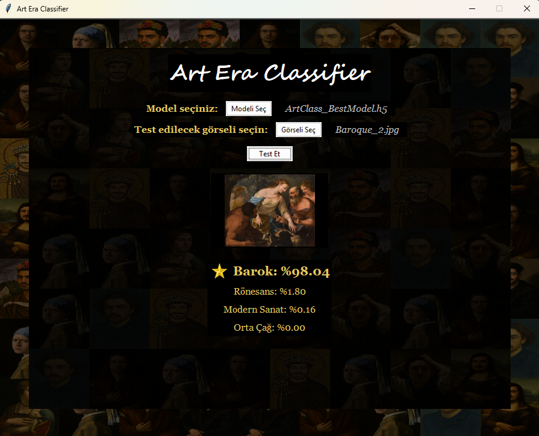

# 🎨 Art Era Classifier

Art Era Classifier, sanat eserlerinin dönemlerini sınıflandırmak için geliştirilmiş bir yapay zeka modelidir. Bu proje, farklı sanat dönemlerine ait eserleri otomatik olarak sınıflandırabilen ve eğitilebilen bir sistem sunar. Özel tasarlanmış derin CNN (Convolutional Neural Network) mimarisi kullanılarak geliştirilen model, yüksek doğruluk oranıyla sanat eserlerinin dönemlerini tespit edebilir.

## ✨ Özellikler

- 🖼️ Özel tasarlanmış derin CNN mimarisi
- 📊 Orta-Yüksek doğruluk oranı (validation accuracy: 0.78)
- 🔄 Farklı sanat dönemlerini otomatik sınıflandırma
- 📈 Eğitim ve doğrulama metriklerinin detaylı analizi
- 🎯 Model performans değerlendirmesi ve görselleştirme
- 📦 Seçili görselleri sınıflayabilen arayüz uygulaması

## 📸 Ekran Görüntüsü

| Görselleri Sınıflayan Arayüz Uygulaması |
|-----------------------------------------|
|                   |

## 🧠 Kullanılan Teknolojiler

- **Python 3.9.21** – Programlama dili
- **TensorFlow 2.10.1** – Derin öğrenme framework'ü
  - TensorFlow Estimator 2.10.0
  - TensorFlow IO 0.31.0
  - TensorBoard 2.10.1
- **CUDA 11.2.2** – NVIDIA GPU Hesaplama Platformu
- **cuDNN 8.1.0** – NVIDIA Derin Öğrenme Kütüphanesi
- **Keras 2.10.0** – Yüksek seviyeli API
- **NumPy 1.23.5** – Sayısal işlemler
- **Pandas 2.2.3** – Veri analizi ve manipülasyonu
- **Matplotlib 3.9.4** – Görselleştirme
- **Seaborn 0.13.2** – İstatistiksel görselleştirme
- **Scikit-learn 1.6.1** – Makine öğrenmesi araçları
- **Pillow 11.2.1** – Görüntü işleme
- **SciPy 1.13.1** – Bilimsel hesaplamalar

## 🚀 Kurulum

```bash
git clone https://github.com/yourusername/Art-Era-Classifier.git
cd Art-Era-Classifier
pip install -r requirements.txt
python AEC_GUI_RUN.py
```

## 📦 Gerekli Dosyalar

Projeyi çalıştırmak için aşağıdaki dosyaların indirilmesi gerekmektedir:

1. En iyi model (~220MB)
2. Tüm modeller (~2.8GB)
3. Veri seti (~1.4GB)

Bu dosyaları indirmek için `DOWNLOAD_Models&Dataset.py` scriptini çalıştırabilirsiniz:

```bash
python DOWNLOAD_Models&Dataset.py
```
=======
# Art_Era_Classifier
AI-powered image classifier that detects the art era (Medieval, Renaissance, Baroque, or Modern) of any uploaded painting using a trained deep learning model
>>>>>>> ce22490f96f7b94c11f6f79e640c9ff0f0a50494
